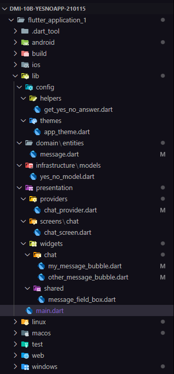

 
 
<h1 align="center"> Universidad Tecnológica de Xicotepec de Juárez </h1>
 

<h2 align="center"> Desarrollo Móvil Integral </h2>
<h2 align="center"> DMI-10B-YesNoApp 210115 </h2>
<h2 align="center"> Por: Mario Gutierrez Rosales </h2>
 
<h2> Objetivo </h2>
Realizar una aplicación en Flutter para Dispositivos Móviles, parte de la Unidad 2 de la asignatura de Desarrollo Móvil Integral, para comprender el usos de Stateless y Statefull Widgets.
 
<h2> Documentación del proyecto </h2>

Aplicación realizada en Flutter para Dispositivos Móviles, parte de la Unidad 2 de la asignatura de Desarrollo Móvil Integral, para comprender el uso de Stateless y Statefull Widgets

## Estructura de las carpetas 

 
<h3> Practica 21 </h3>

| Captura | Descripción | 
|:-------------:|:---------------|
|  | El archivo `main.dart` es el punto de entrada de una aplicación.   El archivo main.dart es el archivo principal de entrada en una aplicación Flutter. En él, se inicializa la aplicación mediante el widget MyApp, que gestiona el estado con el uso de Provider, aplica un tema personalizado definido en AppTheme y establece la pantalla principal como ChatScreen. Esta estructura permite centralizar la gestión del estado y garantiza que la interfaz siga el diseño de Material Design, ofreciendo una experiencia de usuario coherente y eficaz. |
|  | Además, se define la clase AppTheme, que permite crear un tema personalizado para la aplicación, ajustable mediante un conjunto de colores predefinidos. El color seleccionado se adapta según el índice indicado, y la aplicación utiliza Material Design 3 con un esquema de colores determinado por la opción elegida.|
|  | Por último, el widget ChatScreen representa la pantalla de chat, que incluye una barra de aplicaciones (AppBar) con un avatar de usuario y un título. El cuerpo de la pantalla está dedicado a mostrar la vista del chat, gestionada por el widget _ChatView. Esta estructura proporciona una interfaz básica para la funcionalidad de chat.

<h3> Practica 22 </h3>

| Captura | Descripción | 
|:-------------:|:---------------|
|  | _ChatView: Este widget es responsable de representar la vista principal del chat en la aplicación. Utiliza un ListView.builder para mostrar una lista de mensajes que se actualizan dinámicamente según el estado gestionado por el ChatProvider. Los mensajes se diferencian por burbujas estilizadas, las cuales cambian de apariencia según si el mensaje lo envía el usuario o la otra persona. Al final de la pantalla, el widget incluye un campo de texto donde el usuario puede escribir y enviar nuevos mensajes.|
|  | MyMessageBubble: Este widget se utiliza para mostrar los mensajes enviados por el usuario en forma de burbujas estilizadas. La burbuja tiene un fondo con el color primario del tema, y el texto se presenta en color blanco, destacándose de manera clara. Es esencial para dar una apariencia personalizada a los mensajes del usuario dentro de la interfaz de chat. |
|  | OtherMessageBubble: Este widget está diseñado para mostrar los mensajes provenientes de la otra persona en la conversación. Los mensajes se envuelven en un Container con un fondo de color secundario, y el texto se presenta dentro de un Padding para mejorar la presentación visual y asegurar una separación adecuada de los elementos. |
|  | _ImageBubble: Este widget permite mostrar imágenes dentro de burbujas de mensajes. Gestiona el proceso de carga de la imagen, mostrando un mensaje indicativo mientras la imagen se descarga. Las imágenes se presentan con bordes redondeados y se ajustan automáticamente al tamaño de la pantalla, garantizando una visualización correcta en diversos dispositivos. |  |MessageFieldBox: Este widget crea un campo de texto estilizado donde el usuario puede escribir mensajes. Tiene un borde redondeado y un botón de envío. Al presionar el icono de envío o la tecla Enter, se ejecuta una función que maneja el valor ingresado por el usuario. Además, incluye funciones para manejar el foco y la interacción con el teclado, mejorando la experiencia de usuario al escribir mensajes.|

<h3> Practica 23 </h3>

| Captura | Descripción | 
|:-------------:|:---------------|
|  |La clase YesNoModel está diseñada para almacenar las respuestas binarias de tipo "sí o no" que provienen de un servicio externo. Incluye funcionalidades para convertir estas respuestas en un formato legible por la aplicación y viceversa, permitiendo la integración fluida de los datos con otras partes del sistema, como el modelo Message.|
|  | La clase ChatProvider es responsable de gestionar el estado del chat, orquestando las acciones de enviar mensajes, recibir respuestas automáticas, y actualizar la interfaz de usuario en tiempo real. Asegura que la aplicación se mantenga sincronizada con los eventos del chat. |
|  |La clase GetYesNoAnswer actúa como intermediaria entre la API de yesno.wtf y la lógica interna de la aplicación. Gestiona las solicitudes HTTP a la API, transforma las respuestas en formatos comprensibles para la app, y facilita la integración de respuestas automáticas en el flujo del chat, enriqueciendo la interacción del usuario.|  |El método moveScrollToBottom optimiza la experiencia del usuario al garantizar que el contenido más reciente del chat siempre sea visible. Esta funcionalidad permite que la vista se desplace automáticamente hacia abajo, mostrando los nuevos mensajes sin que el usuario tenga que desplazarse manualmente.|

## Resultados
